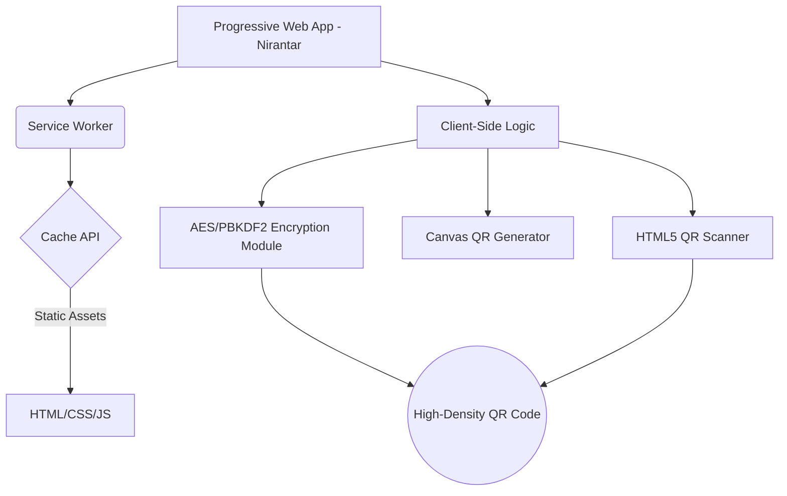
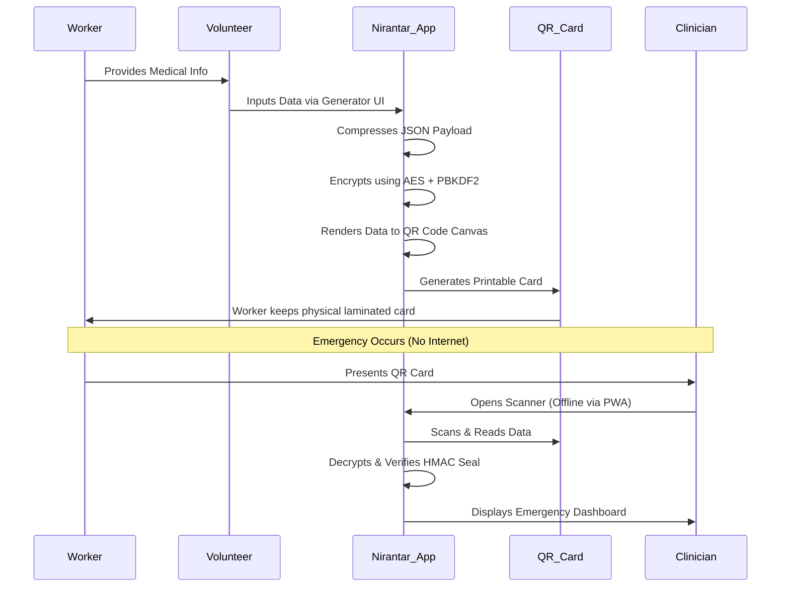
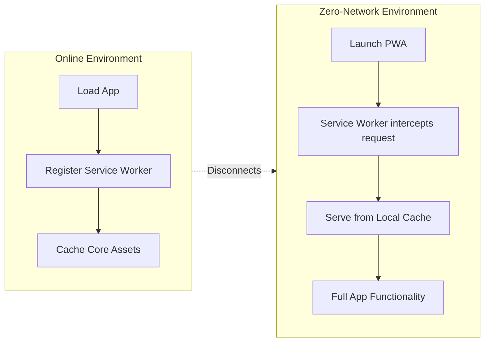

# 🛡️ Nirantar Health
**Offline Health Continuity Portal for Migrant Workers**


[](https://opensource.org/licenses/MIT)
[](https://developer.mozilla.org/en-US/docs/Glossary/HTML5)
[](https://developer.mozilla.org/en-US/docs/Web/CSS)
[](https://developer.mozilla.org/en-US/docs/Web/JavaScript)
[](https://web.dev/progressive-web-apps/)

---

## 📖 Table of Contents
1. [Elevator Pitch](#-elevator-pitch)
2. [Branding & Design System](#-branding--design-system)
3. [Architecture & Data Flow](#-architecture--data-flow)
4. [Features](#-features)
5. [Offline-First & PWA Workflow](#-offline-first--pwa-workflow)
6. [Gallery & Video Demo](#-gallery--video-demo)
7. [Installation & Setup](#-installation--setup)
8. [Accessibility & Compatibility](#-accessibility--compatibility)
9. [Project Portfolio Details](#-project-portfolio-details)
10. [Roadmap & Future Scope](#-roadmap--future-scope)
11. [Community & Documentation](#-community--documentation)
12. [Disclaimer & Privacy](#-disclaimer--privacy)

---

## 🚀 Elevator Pitch
**Nirantar Health** is a completely offline, zero-network Progressive Web App (PWA) designed to provide portable, encrypted health records to migrant workers and rural populations. By condensing complex medical histories, emergency contacts, and vital stats into a high-density, cryptographically sealed QR code, Nirantar ensures that first responders and clinicians can access life-saving patient data instantaneously—even in areas with zero internet connectivity. 

---

## 🎨 Branding & Design System

### Visual Identity
- **Logo Concept**: A fusion of a Medical Cross, a Digital QR Matrix, and a Shield. It represents health, technology, and uncompromised security.
- **Favicon**: A stylized `N` surrounded by a teal medical cross `[+]`.

### Color Palette
- **Background Primary**: `#060e11` (Deep Space Cyan)
- **Background Secondary**: `#0d1e24` (Dark Cyan Slate)
- **Accent Primary**: `#0d9488` (Teal)
- **Accent Success**: `#2dd4bf` (Bright Teal/Mint)
- **Accent Warning**: `#f43f5e` (Rose Red)
- **Text Main**: `#e2f8f5` (Ice White)
- **Text Muted**: `#a4c2c6` (Muted Cyan)

### Typography
- **Primary Font**: `Outfit`, sans-serif. Chosen for its modern, geometric, and highly legible characteristics, especially on low-resolution mobile screens.

---

## 🏗 Architecture & Data Flow

### 1. System Architecture


### 2. Data Flow Diagram


### 3. Offline-First Workflow Diagram


### 4. Folder Structure
```text
health_card_app/
│
├── index.html           # Main application shell (Dashboard, Gen, Scan)
├── styles.css           # Custom UI/UX Design System
├── app.js               # Core logic, encryption, QR generation/scanning
├── manifest.json        # PWA configuration
├── service-worker.js    # Offline caching mechanisms
├── assets/              # Icons, logos, placeholders
│   ├── icon-192x192.png
│   └── icon-512x512.png
└── docs/                # Extended documentation
    ├── CONTRIBUTING.md
    ├── CODE_OF_CONDUCT.md
    └── SECURITY.md
```

---

## ⚡ Features

1. **Zero-Network Functionality**: Operates 100% offline via PWA Service Workers. No backend server or cloud database required.
2. **Cryptographic Security**: Employs AES encryption and HMAC integrity seals to ensure data authenticity and prevent tampering.
3. **High-Density QR Compression**: Compresses complex JSON data (vitals, allergies, emergency contacts) to fit within the constraints of a standard QR code.
4. **Multilingual Support**: Dictionary-based translation for 6 regional languages to aid rural volunteers.
5. **Real-time Analytics Dashboard**: Tracks total cards issued, epidemic stats, and local registry search capabilities (stored locally).
6. **Symmetrical Card Reader**: Built-in HTML5-based camera scanner that instantly decrypts and renders the health dashboard for clinicians.

---

## 🔌 Offline-First & PWA Workflow

**Progressive Web App (PWA) Implementation**:
- **Manifest**: The `manifest.json` file dictates how the app behaves when installed on a mobile home screen (standalone mode, theme colors, icons).
- **Service Worker**: `service-worker.js` intercepts network requests. On the very first load (while online), it caches `index.html`, `styles.css`, `app.js`, and external libraries (CryptoJS, QRCode.js, Html5-Qrcode).
- **Offline Capabilities**: Subsequent launches of the application retrieve files directly from the device's cache. The QR generation, encryption, and camera scanning happen entirely on the client's CPU.

---

## 📸 Gallery & Video Demo


| Real-Time Dashboard | Health Card Generator |
|:---:|:---:|
| `` <br> *View local registry stats and offline analytics.* | `` <br> *Input demographics, medical history, and capture photo.* |

| Physical Card Preview | Symmetrical Scanner |
|:---:|:---:|
| `` <br> *Printable laminated card layout with generated QR.* | `` <br> *Clinician view showing decoded emergency patient data.* |

### 🎥 Demo Video
``
> *Watch the full zero-network workflow from patient ingestion to emergency scanning.*

---

## 💻 Installation & Setup

1. **Clone the Repository**:
   ```bash
   git clone https://github.com/Ariha1510/health_card_app.git
   cd health_card_app
   ```
2. **Run a Local Server**:
   Because the app uses modules, Service Workers, and camera APIs, it must be served over `http://localhost` or `https://`.
   ```bash
   # Using Python
   python -m http.server 8000
   
   # Using Node.js
   npx serve .
   ```
3. **Access the App**:
   Navigate to `http://localhost:8000`.
4. **Install PWA**:
   Click the "📥 Install App" button in the header, or use your browser's "Add to Home Screen" prompt to install it natively on your device.

---

## ♿ Accessibility & Compatibility

### Accessibility (A11y)
- Semantic HTML tags (`<header>`, `<main>`, `<footer>`, `<h2>`, `<h3>`).
- Form elements are rigorously paired with corresponding `<label>` tags or `aria-label` attributes for screen reader compatibility.
- WCAG 2.1 Compliant contrast ratios (e.g., `#a4c2c6` text on `#060e11` backgrounds).

### Browser Compatibility
| Browser | Generator Support | Scanner Support | PWA Offline Support |
|---------|:---:|:---:|:---:|
| Google Chrome | ✅ | ✅ | ✅ |
| Safari (iOS 11+) | ✅ | ✅ | ✅ |
| Mozilla Firefox | ✅ | ✅ | ✅ |
| Microsoft Edge | ✅ | ✅ | ✅ |

---


## ❓ FAQ & Known Issues

**Q: Does the scanner require an internet connection to read the QR?**
A: No. The decryption key and parsing logic are entirely self-contained within the PWA client logic.

**Known Issues**:
- Extremely long medical histories may exceed the maximum data capacity of standard QR codes, even with JSON minification. (Future fix: multi-QR pagination or binary encoding).

---

## 📜 Community & Documentation

- [Contributing Guidelines](CONTRIBUTING.md)
- [Code of Conduct](CODE_OF_CONDUCT.md)
- [Security Policy](SECURITY.md)
- [Changelog](CHANGELOG.md)

---

## ⚖️ Disclaimer & Privacy Policy

**Disclaimer**: This application is a prototype built for a Hackathon and Social Impact demonstrations. It is not currently certified for HIPAA/clinical compliance. 

**Privacy Policy**: Nirantar Health does not collect, transmit, or monetize user data. All data inputted into the system is either printed directly to the physical QR card or temporarily stored in the local browser's `localStorage` (which never leaves the host device).

